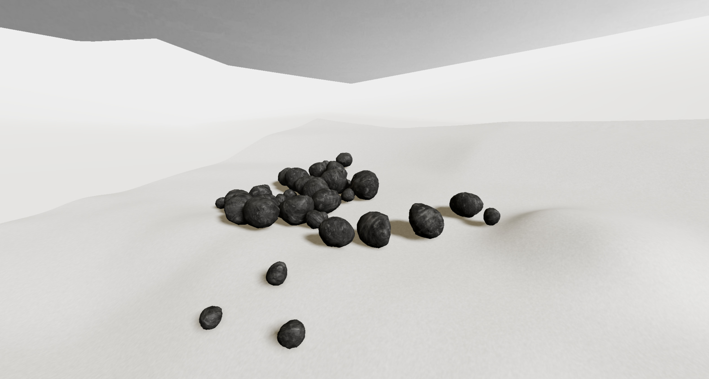

# Rock Physics Simulation



This project is a web application that simulates the physics of rocks falling from a height. You can generate rocks by clicking on the surface with the left mouse button or by pressing the spacebar for continuous rock generation.

## [Demo](https://d971d54a-6f4d-4f3b-9027-1b16a0c29369.selstorage.ru/media/3d/rock-physics-simulation/index.html)

## Features

- Physics simulation using Cannon.js
- 3D rendering with Three.js
- Simple user interaction to generate rocks

## Getting Started

### Prerequisites

Make sure you have [Node.js](https://nodejs.org) installed on your system.

### Installation

1. Clone the repository:

   ```
   git clone https://github.com/tour3d/rock-physics-simulation.git
   ```

2. Navigate to the project directory:

   ```
   cd rock-physics-simulation
   ```

3. Install the dependencies:
   ```
   npm install
   ```

### Running the Application

To start the development server and open the application in your browser, run:

```
npm start
```

### Building for Production

To create a production build, run:

```
npm run build
```

## Project Structure

- `src/`: Contains the source code for the application.
- `static/`: Contains static assets like images and models.
- `index.html`: The main HTML file for the application.
- `webpack.config.js`: Configuration file for Webpack.

## Dependencies

- `three`: ^0.165.0
- `cannon-es`: ^0.20.0
- `three-gltf-loader`: ^1.111.0
- `fs`: ^0.0.1-security
- `path-browserify`: ^1.0.1

## Dev Dependencies

- `@babel/core`: ^7.24.7
- `@babel/preset-env`: ^7.24.7
- `babel-loader`: ^9.1.3
- `webpack`: ^5.92.1
- `webpack-cli`: ^5.1.4
- `webpack-dev-server`: ^5.0.4
- `copy-webpack-plugin`: ^12.0.2
- `html-webpack-plugin`: ^5.6.0

## Author

Alexey Yuzhakov

## License

This project is licensed under the ISC License.
